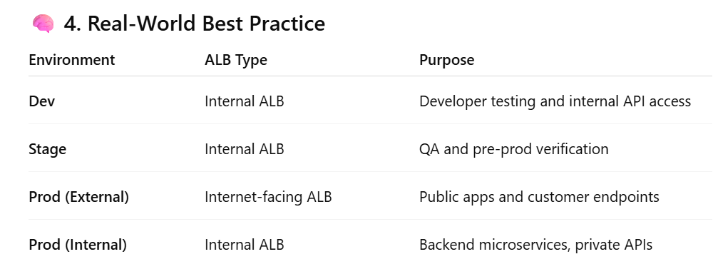
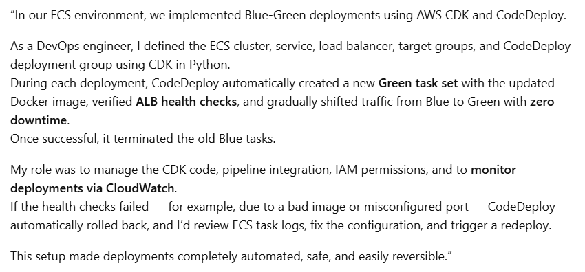
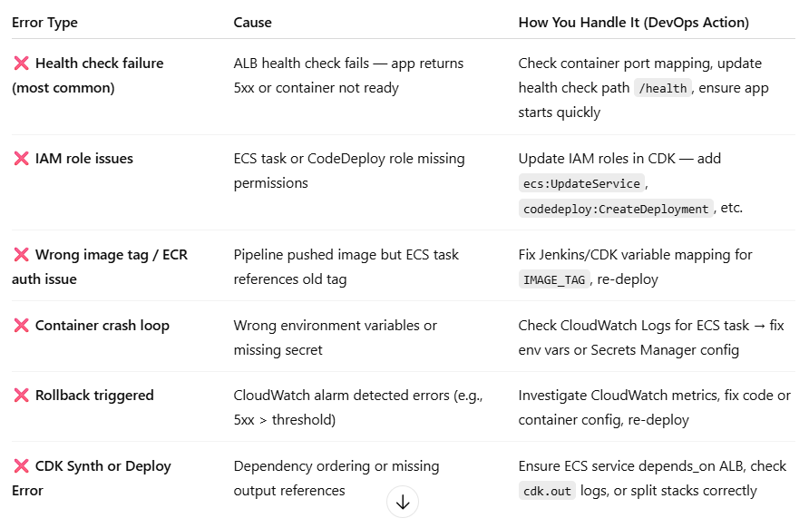
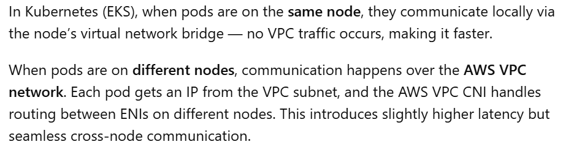
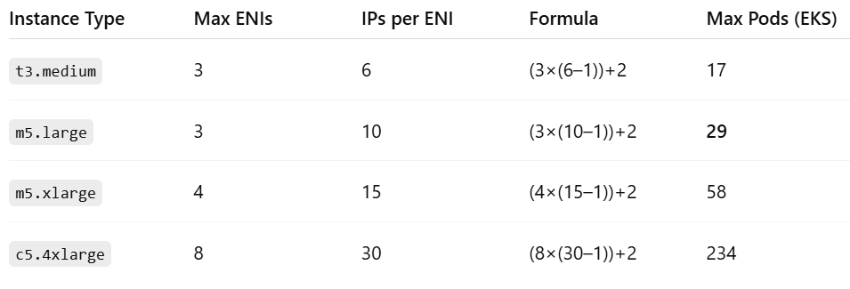

## difference between alb and nlb
    alb is the application load balancer 
    it is a layer 7 load balance
    http and https protocal support
    Health check up of HTTP and HTTPS application

    TCP and UDP protocal support
    Networking level TCP and TLS
    NLB is static IP address

    HTTP (HyperText Transfer Protocol) - Web traffic (non-secure)
    HTTPS (HyperText Transfer Protocol Secure) -Secure web traffic
    TCP (Transmission Control Protocol) - Web, email, SSH
    UDP (User Datagram Protocol)    - DNS, video streaming, gaming

## Ingress controller
    An Ingress Controller is a Kubernetes component that manages external access to multiple services inside the cluster — typically over HTTP and HTTPS.
    It acts as a Layer 7 (application layer) load balancer, enabling path-based and host-based routing to different services using a single entry point.

    Client → DNS → Load Balancer (ALB) → Ingress Controller (ALB controller) → Service → Pod

    By default, an EKS cluster doesn’t come with an ALB Ingress Controller.

---------------------------------------------
# CI/CD Pipeline Flow Explanation (Step-by-Step)------------------

 ## Code Push and Pull Request (PR):
    Developers push their code changes to the Git repository.
    After the push, they raise a Pull Request (PR) for review and approval.
    Once the PR is reviewed and merged into the required branch (e.g., main or develop), it automatically triggers the CI/CD pipeline.
 ## Pipeline Trigger when PR merged:
    The pipeline is configured to trigger automatically on PR merges using a webhook or pipeline trigger configuration in the CI tool (e.g., Jenkins, GitHub Actions, GitLab CI, or Harness).
 ## Build Stage (Maven Build):
    The pipeline starts with a Maven build, compiling the source code.
    It runs unit test cases to validate code functionality and quality.
    Maven then packages the application based on the pom.xml configuration — generating .jar or .war files depending on the project type. (jar file is java based .war file for web based)
 ## Docker Build Stage:
    Using a Dockerfile, the pipeline builds the Docker image of the application.
    The image is tagged with version details (for example: v1.0.0 or build-<build_id>) for version control and traceability.
 ## Security Scanning (Trivy):
    The built image is scanned using Trivy to identify vulnerabilities.
    If critical vulnerabilities are found, the pipeline fails and sends feedback to the developer to fix the issues.
    If the scan passes with no critical issues, the pipeline proceeds.
 ## Push to Amazon ECR:
    The pipeline logs in to Amazon Elastic Container Registry (ECR).
    The validated Docker image is pushed to ECR for versioned storage and future deployments.
 ## Disaster Recovery Backup in S3 bucket:
    For disaster recovery purposes, a copy of the Docker image (or metadata) is also stored in an S3 bucket.
 ## Deployment to Amazon ECS:
    The pipeline updates the ECS Task Definition with the new Docker image tag.
    The ECS Service is updated or redeployed to use the new task definition.
    ECS automatically schedules new tasks and manages scaling based on load and desired count.
 ## Post-Deployment Validation:
    ECS monitors the deployment to ensure containers are running successfully.
    If issues occur, ECS or the pipeline can trigger an automatic rollback to the previous stable image.

## Hi [Name],
    My name is Siva Vanga, and I am based in Hyderabad. I have been working with Ascendion for the past few years, contributing to major client projects like Huron, Rackspace, and TransUnion.
# TransUnion Project – Migration Project
   “In my last project, I was responsible for migrating multiple repositories from Bitbucket and GitHub into Harness to streamline our CI/CD workflows and improve deployment automation.

    We used Kong Konnect for API management, where I set up both the Control Plane (CP) and Data Planes (DP) to ensure secure and efficient communication between microservices. The infrastructure setup involved creating CP and DP configurations and synchronizing them using Ansible Tower.

    During Ansible Tower runs for installing the CP and DP, we faced issues such as template variable mismatches and repository credential errors. I troubleshot these through detailed log analysis and by refining the automation scripts and templates to make the process more stable and reusable.

    Once the CP and DP were synchronized, we deployed custom Kong plugins for specific use cases like token validation, header transformation, and traffic control. These plugins were installed and validated through the Kong Konnect UI, where we could also monitor the status of CP and DP, check their sync health, and ensure plugins were correctly registered and active.

    In the Kong Konnect UI, we monitored:
        The Control Plane and Data Plane connectivity status, sync frequency, and heartbeat logs.
        Plugin deployments, including version, configuration, and runtime status.
        API deployments and microservices through real-time traffic insights, request latency, and error metrics.

    Once the infrastructure was in place, I automated API deployments using Harness, where Ansible Tower playbooks were triggered from Harness pipelines to deploy and configure Kong resources like services, routes, and plugins. This maintained configuration consistency and reduced manual intervention.

    The Control Plane managed all API configurations—including services, routes, plugins, and policies—and continuously synchronized them to Data Planes running in Kubernetes clusters. Our deployment process was fully automated: after building and pushing service images, Harness triggered Helm-based deployments to EKS, updating API routes and plugins automatically using declarative configuration.

    For secrets management, we integrated HashiCorp Vault to dynamically fetch credentials, certificates, and tokens during deployments, eliminating any need for hard-coded secrets.

    We used Grafana dashboards to monitor API and plugin performance, pulling metrics from Kong and Prometheus to track latency, request rates, and error responses. This, combined with the Kong Konnect UI monitoring, provided complete visibility across CP, DP, plugin health, and API traffic behavior.”

 # Rackspace Project – AWS Multi-Account Management
    Managed approximately 700 AWS accounts, leveraging AWS Control Tower for efficient governance.
    Organized accounts into logical groups and applied Service Control Policies (SCPs) to enforce security and compliance at scale.
    Avoided the need to manually create IAM policies for every individual account.
    Applied group-wise SCPs to ensure consistent access controls across multiple accounts.
    Implemented monitoring and auditing by integrating with CloudTrail, CloudWatch, and AWS Security Hub, ensuring all accounts adhered to organizational security standards.
    Provided centralized management for account creation, grouping, and policy enforcement, making operations more efficient and secure.
    
    Key Skills and Expertise Demonstrated
    Cloud Platforms: AWS (Control Tower, IAM, SCPs, CloudTrail, CloudWatch, Security Hub)
    CI/CD & Automation: Harness, Ansible templates, Repository migration
    API Management: Kong Konnect, CP & DP setup, API security
    Troubleshooting: Identifying and resolving deployment and configuration errors
    Project Delivery: Successfully delivered large-scale migration and governance projects

 # Day-to-Day Kubernetes ( k8 ) Activities (Final Polished Version)

        In our setup, Grafana was deployed as part of the kube-prometheus-stack Helm chart, which automatically loads dashboards for Kubernetes clusters, nodes, and pods.

        On a daily basis, we monitor Grafana dashboards to check pod status, crash loops, cluster utilization, deployment errors, PVC binding status, and latency issues.

        For example, if a PVC is in a pending state, Grafana triggers a storage alert. I check it using kubectl get pvc and kubectl describe pvc to identify whether it’s due to a missing or misconfigured StorageClass or CSI driver. Once I fix the configuration or IAM permission, the PVC binds automatically.

        If Grafana shows high latency, I check pod and node metrics — CPU, memory, and network usage — and review pod logs for throttling or timeouts. Usually, scaling the service or optimizing backend queries fixes the issue.

        Apart from that, we also monitor and handle issues like:

        ⚙️ Common Kubernetes Issues & Fixes
        1️⃣ Pod CrashLoopBackOff — Error
            If Grafana shows repeated pod restarts, I will check pod logs for configuration or connection errors. find the error and resolved  and redeploy after fixing the root cause.
        2️⃣ Node NotReady — Error
            If a node goes into a NotReady state, I willcheck node metrics in Grafana and either scale up the cluster or drain and replace the node.
        3️⃣ Image Pull Error (ECR) — Error
            For image pull errors, I will verify the image path and registry credentials, we can go to update  the deployment YAML file  after changes done we can redeploy the pod.
        4️⃣ Deployment Stuck / Unavailable Replicas — Error
            If Grafana shows unavailable replicas in a deployment, I will check the readiness probe configuration and resource limits if need we can adjust.
        5️⃣ Cluster Utilization High — Error
            If cluster utilization reaches 80–90%, we can scale the nodes automatically using the Cluster Autoscaler and review HPA (Horizontal Pod Autoscaler) thresholds.

        🧩 Final Wrap-Up
        So overall, our daily activities focus on proactively monitoring cluster health through Grafana, identifying performance or configuration issues early, and resolving them using kubectl, scaling strategies, and configuration updates to ensure high availability and stability across all Kubernetes environments.

        
        Crash Loop:
            ------------------
            A CrashLoopBackOff means the container keeps crashing and restarting, usually due to app or config issues.
            Common causes include missing environment variables, insufficient memory (OOMKilled), bad entrypoints, or permission issues.
            I usually start by checking logs, describe events, and verify resource limits or dependencies before redeploying.”
            ------------------
            Container in the Pod starts → crashes repeatedly → Pod never becomes Ready.
            When a Pod crashes, kubelet restarts the container with exponential backoff. 
            Insufficient resources (OOMKilled)
                    Container exceeds CPU/Memory limits and is killed.
                    Increase resource limits in Pod/Deployment YAML.
            Missing dependency
                    Required packages, binaries, or services are not available.
                    Use correct base image or install dependencies in Dockerfile.
            Missing or invalid environment variables
                    App expects certain env vars (DB_URL, API_KEY, etc.) not provided.
                    Check and add missing environment variables via ConfigMap/Secret.
            ConfigMap/Secret not mounted properly
                    App can’t find its config or credentials.
                    Verify volume mounts and file paths.
            Port already in use
                    Container tries to bind to a port already occupied.
                    Use a different containerPort or stop conflicting sidecar.
                    Sidecar: The main container is the “driver”, and the sidecar is the “assistant” helping it do its job.

    # Daily activity of k8
    Check pod health checks:    kubectl get pod -a:     grafana dashboard alterting pod crashloop
    Check pod restart alert:    kubectl logs:        Prometheus metric restarts_total triggers alert
    node resources:             kubectl top node:   Grafana Node Exporter metrics
    pvc not bound:              kubectl get pvc:    Alert: “PVC pending > 10 minutes”
    cluster utilzation:         kubectl get node:   Grafana cluster overview dashboard
    Deployement status:         kubectl rollout status: Grafana “Deployment health” dashboard

    “In our setup, Grafana was deployed as part of the kube-prometheus-stack Helm chart, which automatically loads default dashboards for Kubernetes cluster, node, and pod metrics. We also imported a few community dashboards from Grafana.com to monitor EKS-specific metrics like API latency and pod restarts.”

## python related cdk---

    “In one of our projects, we needed to ensure data resilience across AWS regions, so I automated S3 Cross-Region Replication (CRR) using AWS CDK in Python.

    I created a CDK stack that defines both the source and destination buckets, enabled versioning, and attached an IAM role allowing replication.
    Then, I configured the replication rule at the resource level, specifying the destination ARN.

    Once deployed, any new object uploaded to the primary bucket in ap-south-1 is automatically replicated to the DR bucket in ap-southeast-1.

    I also integrated a Python boto3 validation script that periodically checks whether the replication is successful by comparing object keys and timestamps.
    This setup is part of our Disaster Recovery strategy, ensuring RPO (Recovery Point Objective) of near-zero for S3 data.”

 # AWS tools----
    minoring tools like cloud watch and could trail.
        cloud watch monitoring system performing. (monitor cpu usage)
        cloud trail is who is done and what is happens.

    AWS security hub and graffana and promotheus
        Centralized security and compliance monitoring across your AWS environment.
    

  # ECS and EKS 
    ECS full managed container service
    used for only aws
    cluster managed automatically
    quick deployment and aws cloud
    ------
    EKS fully managed by k8
    used for standrad k8
    required to managed nodes
    complex and managed multi cloud
    --------
    ECS = AWS-managed, simpler, tightly integrated with AWS. Good for users who want less overhead.
    EKS = AWS-managed Kubernetes, highly flexible, portable, but requires Kubernetes knowledge.
    ------------
    Use ALB (Ingress) for web APIs (like /auth, /credit-score).
    Use NLB (Service type LoadBalancer) for non-HTTP apps or static-IP access.
    teUse ClusterIP for internal-only communication.

  # S3
    types:  standrad s3 bucket: for storing TF state files, store build artifactory
            versioning : TF remote backend state for versioning and rollback
            Access-Logged :for access logs or audit tails

            # Enable Block Public Access at bucket and account level.  
            AWS KMS work flow:
                User    → AWS Service (e.g., S3, EBS)
                        → Calls AWS KMS API
                        → KMS uses your key to encrypt/decrypt
                        → Encrypted data stored in service

  # Cloud Trail
        Minitoring the logs. when unexpectly and bymistake any one deleted resources.
  # Cloud Watch
        Mintoring the metrics logs. when like how much cpu memory utilized and what s pending all these things.

  # security hub
        integrated tools likes guard duty and cloud trail
        it is the centralized 

===============================
 ## Docker
===============================
# Docker Commnads
    docker images
    docker pull <image_name>:<tag>
    docker build -t <image_name>:<tag> <path>
    Remove an image:    docker rmi <image_id_or_name>
    List running containers:   docker ps
    List all containers (running + stopped):    docker ps -a
    
    Run a container:    docker run -it --name <container_name> <image_name>:<tag>
    Stop a container:   docker stop <container_id_or_name>
    Start a container:  docker start <container_id or name>
    ReStart a container:  docker restart <container_id or name>
    Remove a container:  docker rm <container_id or name>

    List of volumes:    docker voulme ls
    create volume:  docker volume create <volume_name>
    remove voulme:  docker volume rm <voulme_name>
    You can mount the volume to a specific path inside the container:
        docker run -d --name my-container -v my-volume:/app/data <image_name>

    list of network:    docker network ls
    create network:     docker network create <network_name>
    remove network:     docker network rm <network_name>
    Connect container to network:
        docker network connect <network_name> <container_name>

    clear docker junk files:        docker system prune -a -f
    find the files larger 1GB:      find / -type f -size +1GB -exec ls -lh {} \;
    find larger directories in specific path: du -h /var/* | sort -h
    find which directory used more space:    du -sh * | sort -h

    Linux commands
    Most space dir  du -sh * | sort -h
    Find files larger than 1 GB  
            find / -type f size +1GB -exec ls -lh {}\;
    which dir used more space  du -sh * | sort -h
    Disk usage  df -h and du -sh /path
    top
    Real-time CPU, memory, load average, and process usage.
    vmstat
    Shows memory, CPU, I/O, swap usage (system performance overview).
    free
    Displays total, used, and free memory (RAM + swap).
    df
    Disk usage per filesystem.
    Kill process: kill <PID>
    Change permission  chmod 755 file
    Change file owner  sudo chown user:group filename.sh
    User creation:
    New user  sudo useradd user_name
    New group  sudo groupadd group_name
    Add in group  sudo usermod -aG group_name user_name
    Give only one user required readonly access   sudo setfacl -m u:use_name:r-- /file_path.sh
    Remove write access particular user  sudo setfacl -Rm u:user_name:rx /file_path.sh

    Cron job
    Find list of jobs  Crontab -l
    Edit the cron job  Crontab -e
                                    ***** /file_path.sh

	
    

# NACL (Network Access Control List): Subnet Level/ Stateless/ Default NACL allows all/ 
# Security Group:     Instance Level/ Stateful/ Default SG denies all inbound/ 

==========================================
## K8
===================================
# You want to restrict inter-namespace communication. How?

# how to connect service and pods
# diff docker container and k8 pod
    k8 pod is lowest level deployment
    multiple container is maintained in the pod

# what is namespace
    logical isolation of resources, networking, policies and rbac and everything.
# PV and PVC
    PV means persistant volume
    PVC means persistant volume claim

# pod to pod connectivity EKS
    # pod to pod connectivity with same node
        connected with linux bridge, no VPC involvement, band width node-level NIC limit
    # pod to pod connectivity with different node
        connected with vpc network, VPC routing table, band width VPC network limit
        => each node having one ENI (Elastic Network Interface) or NIC (Network Interface card)
            depend on the EC2 instance m5.large we have 3 ENI's
            each ENI = 10 IP's (by defulat one IP reserve the ENI) 
    # in AKS
        same node connected with Local vswitch
        differnt node connected with Route via Azure VNET

# Daily activity of k8
    Check pod health checks:    kubectl get pod -a:     grafana dashboard alterting pod crashloop
    Check pod restart alert:    kubectl logs:        Prometheus metric restarts_total triggers alert
    node resources:             kubectl top node:   Grafana Node Exporter metrics
    pvc not bound:              kubectl get pvc:    Alert: “PVC pending > 10 minutes”
    cluster utilzation:         kubectl get node:   Grafana cluster overview dashboard
    Deployement status:         kubectl rollout status: Grafana “Deployment health” dashboard

    “In our setup, Grafana was deployed as part of the kube-prometheus-stack Helm chart, which automatically loads default dashboards for Kubernetes cluster, node, and pod metrics. We also imported a few community dashboards from Grafana.com to monitor EKS-specific metrics like API latency and pod restarts.”

 #   Daily workflow in real DevOps setup
   #    Morning check dashboards
            Open Grafana dashboards (Cluster Overview, Workload Health).
            Review any red/yellow alerts triggered overnight.
            Check alert notifications (Slack/Email).
   #    Investigate alerts
            If Grafana shows a spike in CPU or pod restarts → use kubectl to debug the specific pod or deployment.
   #    Remediate issues
            Restart pods, scale deployments, or fix underlying issues (like node resource exhaustion).
   #    Update monitoring rules if needed
            Modify alert thresholds (e.g., adjust CPU limits).
            Add new panels for new services.
   #    Document findings
            Update team Slack or incident management system.
  
===============================
 ## Terraform (Infrastrcture as a code)
===============================
    we have a commands for init plan apply and destroy
    modules we can use 
# Blue green deployment
    ---------------------
    In our project, we used Blue-Green deployment across multiple production regions.
    We first created new instances (Green), deployed the application and Data Plane, and synced it with Kong Konnect Control Plane.
    After verifying the sync, custom plugins, and endpoint health, we switched traffic from Blue to Green by updating the ALB target group through Terraform.
    This provided zero downtime, safe rollback, and consistent multi-region rollout.
    ---------------------
    # terrform files: providers.tf, backend.tf, versions.tf, main.tf, output.tf, variables.tf, terraform.tfvars
        .tfvars file is filled with actual variable we can call from .tf file.
    # terraform.tfstate 
        file is keep tracking the current state resources
    if you need to update or add new resources state file is checking wheher the update of resources already exist or not.

    state file is deleted we can import the state file from s3 bucket if backup is there.

    # terraform refresh : manuall update resources synch 
    # terraform taint: Marks a resource for recreation in the next apply.
    # terraform import: Imports existing resources into Terraform state without re-creating them.
    # data source: They let you fetch information from existing resources (read-only).
    # drift: Run terraform apply → to reconcile drift.
             Run terraform refresh → to sync the state.
    
# Your team stores Terraform state in an S3 backend. During an apply, you get an error saying:
    Error acquiring state lock: ConditionalCheckFailedException
    terraform using dynamo db for state lock so somebady is alredy apply done
    so we need to wait until the sucess after that we can use terraform force-unlock <lock-id>

# You lost your local terraform.tfstate file — what do you do?
    if the backend we can use the s3 bucket for storage
    we can re-run the terraform init it will download the .tfstate file

# You have a Terraform setup for multiple OUs (Dev, Prod, Security) under AWS Organization.
    You only want to apply the changes to the Dev OU. How do you ensure that?

# how we can choose tf state file in s3 bucket?
    we can use backend.tf
    we can use versioning_configuration statu= enable 

    

=====================================
# Harness
==================================

# Compare the Harness and Azure DevOps
    Azure DevOps is complete devops related like boards, repos ci cd 

    In my last project, we used both Azure DevOps and Harness, so I’ve seen the difference firsthand.

    For example, in Azure DevOps, we had our CI/CD pipeline defined completely in YAML — the build stage used Maven to package code, SonarQube for scanning, then we pushed the Docker image to ECR and deployed it to AKS using Helm. It worked, but most of the steps were scripted manually, including rollback logic and health checks. Whenever we needed approval gates or post-deployment validation, we had to build custom stages or rely on external scripts.

    When we moved part of the setup to Harness, the same pipeline became much simpler. We just connected our Git repo and ECR through built-in connectors, defined services and environments visually, and Harness handled the deployment with built-in rollback and verification. It pulled metrics from Prometheus to validate each release automatically. We also used its delegate to run pipelines securely in our own network, without exposing credentials.

    So, the main difference I noticed is that Azure DevOps gives full control but needs more effort and YAML scripting, while Harness automates most of that — it’s more intelligent and faster for multi-cloud and Kubernetes deployments. For large-scale delivery pipelines, Harness saved us a lot of time and reduced manual intervention.”
---------------------
    We used Harness connectors for Git, SonarQube, and AWS, so we didn’t have to script authentication or API calls manually. The pipeline triggered automatically on each commit, built the artifact using Maven, ran the SonarQube quality gate, and then built and pushed the Docker image to ECR. From there, our Harness CD pipeline deployed it to EKS. Everything ran through the Harness delegate, keeping credentials secure and infrastructure isolated. This reduced our YAML complexity drastically compared to Azure DevOps.

# What is a Harness Delegate?
    A: A Delegate is a lightweight agent installed in your environment (on-prem or cloud) that connects Harness to your infrastructure securely. It executes pipeline tasks like deployments, fetching artifacts, or connecting to Kubernetes clusters.

# How did you handle rollbacks in Harness?
    A: Harness’ continuous verification feature monitored metrics/logs after deployment. If the plugin or service failed health checks, Harness automatically rolled back to the last stable version.

    interview
    k8
    rosource utilization
    crash loop back
    db 

    pipeline
    azure devops secrect integrate

=========================================
## Azure DevOps
=========================================

    ---------------
    “In my last project, we deployed a .NET microservice (code stored in Azure Repos) to AWS EKS using Azure DevOps pipelines.
    The CI pipeline was designed to build, test, and scan the code using SonarQube for code quality and Trivy for container vulnerability scanning.
    Trivy helped us detect vulnerabilities in the base image, which we resolved by upgrading to a patched version.

    In the CD stage, Terraform was used to provision EKS infrastructure components like node groups, IAM roles, and networking resources, while Helm charts handled the deployment of .NET containers into EKS namespaces.
    Secrets and credentials were securely fetched from HashiCorp Vault at runtime to avoid hardcoding.

    We configured ALB Ingress for routing traffic between multiple microservices and used Prometheus and Grafana for monitoring API latency, error rates, and resource utilization.

    Additionally, I handled and resolved issues such as CrashLoopBackOff pods (caused by missing environment variables), Helm release failures due to version conflicts, and Docker build errors by adjusting the dotnet publish step.

    I also optimized the pipeline by enabling build caching and implemented approval gates before production deployment, ensuring smooth and secure delivery across Dev, QA, and Prod environments.”
    -----------------------------
    Issue	                                    | Resolution
    Build failed due to missing NuGet packages: Cached dependencies and fixed version in .csproj
    Terraform apply failed (state lock / permission):   Used unique state files and fixed SPN roles
    Trivy scan failed (high CVEs):  Updated base image and re-scanned
    Helm deployment failed (CrashLoopBackOff):  Fixed image tag / env variable in Helm values
    Secrets not fetched from Key Vault: Updated Key Vault policy and renewed SPN certificate
    5xx errors after deployment:    Added missing environment variable and redeployed
    Pipeline too slow:  Added caching and parallel jobs to reduce time
    Merge blocked by branch policy:	Resolved PR conflicts and re-ran validation build
    Terraform drift detected:	Re-ran plan, reviewed manual changes, and re-applied infra
    SonarQube quality gate failed:	Fixed code smells and vulnerabilities before merge

    
    “In my daily work, I manage CI/CD pipelines in Azure DevOps for multiple applications. I monitor build and release pipelines, troubleshoot failures, and ensure smooth deployments across Dev, QA, and Prod environments.

    For infrastructure provisioning, I use Terraform pipelines integrated with Azure DevOps, and the Terraform state files are stored securely in an Azure Blob Storage account. For example, when provisioning AKS clusters or Azure Key Vaults, I make sure that all resources are tagged properly and follow the organization's naming conventions.

    I’ve also integrated SonarQube and Trivy scans within the build stage for vulnerability and code quality checks. Once, we identified high-severity CVEs in base images through Trivy, so I updated the base Docker image version and re-triggered the pipeline to ensure a clean security report.

    For secrets management, I use Azure Key Vault — secrets like service principal credentials or database connection strings are dynamically pulled during the deployment, avoiding any hard-coded values in YAML files.

    Post-deployment, I validate application health using Azure Application Insights and Grafana dashboards. For instance, after one release, we noticed an increase in 5xx errors in Grafana metrics; I traced it back to a misconfigured environment variable and fixed it in the pipeline variable group.

    Additionally, I collaborate closely with developers to manage pull requests, enforce branch policies, and standardize pipeline templates across microservices. I also work on optimizing pipelines by adding caching for Maven dependencies and parallelizing build jobs — this reduced the overall build time by nearly 40%.

    # Example of Banking application user required credit score.
        we have like auth svc and credit score svc and customer user svc
            user login the app goes request auth svc
            auth svc validate the token and forward the request to credit score svc
            credit score svc fetch the user data from customer user svc
            it calls external credit bureau api
            api responce 820 score on the ui
            the meric logs are pushed to premethous and diplay the grafana.
                ----
                ALB and Ingress -- handle route and ssl termination
                Cluster IP - commincated internally the micro svc
                Vault Integration - secure secret manager
                Prometheus & Graffana - obeserbility of api performance
                IAM Roles - secure access b/w eks pods and aws svc's

    =============
    Thanks for the opportunity. I’m committed to giving my 100% and delivering the best results — both technically and professionally.”