# Hi [Name] ==================

    My name is Siva Vanga, and I am based in Hyderabad. I have been working with Ascendion for the past few years, contributing to major client projects like Huron, Rackspace, TransUnion and Pearson
    =======================================
    My name is Siva Vanga, and I’m based in Hyderabad. I’ve been working with Ascendion for the past few years, contributing to major client projects including Huron, Rackspace, TransUnion, and Pearson.

    I have hands-on experience with AWS cloud, and CI/CD tools such as Jenkins, Azure DevOps, and recently Harness. With Jenkins and Azure DevOps, I’ve worked extensively with pipeline scripting using shell and YAML. Harness is relatively new for me, but I’ve found its UI-driven CI very efficient, allowing us to configure pipelines easily without writing extensive scripts compared to Azure DevOps.

    I’ve also worked on monitoring and security using tools like AWS CloudTrail, Amazon CloudWatch, AWS Security Hub, Prometheus, and Grafana. On the container side, I have experience with Docker and Kubernetes, along with configuration management using Ansible Tower.
    --------------------------------------
    AWS Cloud Trail:    CloudTrail records who did what, when, and from where in your AWS account.
    AWS Cloud Watch:    CloudWatch is used for operational monitoring, metrics, logs, and alerting.
    AWS Security Hub: Security Hub is a central security of aws account dashboards finding from guard duty, Inspector, Cloud Trail.
    ----------------------------------------

    In addition, I have experience writing automation using Python and shell scripting, mainly for infrastructure validation, CI/CD workflows, and operational tasks.

    ==================GitOps==============
    In my last project, we implemented GitOps using Argo CD across multiple environments including dev, stage, UAT, pre-prod, and prod. For new feature development, the client required isolated Kubernetes clusters so teams could validate changes without impacting shared environments.

    Our approach was to provision a dedicated feature cluster using Terraform. Terraform handled the day-0 setup — creating the cluster, networking, IAM, and installing Argo CD inside the cluster. Once Argo CD was running, I connected it to our GitOps repository and verified the connection using the Argo CLI repo list.

    After that, I created Argo CD Applications pointing to the feature-specific folder in Git. From that point onward, Argo CD continuously reconciled the cluster state from Git, automatically deploying the platform components and application workloads.

    For observability, we monitored pod health, node status, and application metrics using Prometheus and visualized everything through Grafana. This allowed us to validate deployments, track pod status, and ensure the feature environment was healthy.

    Once feature testing was complete, we cleaned up by removing the Git configuration and destroying the feature cluster via Terraform. Overall, Terraform handled cluster provisioning, Argo CD managed day-1 and day-2 operations through GitOps, and Prometheus/Grafana provided continuous visibility — giving us a fully automated, auditable, and scalable workflow for feature environments.
    =======================================
## TransUnion Project – Migration Project

        “In my last project, I was responsible for migrating multiple repositories from Bitbucket and GitHub into Harness to streamline our CI/CD workflows and improve deployment automation.

        We used Kong Konnect for API management, where I set up both the Control Plane (CP) and Data Planes (DP) to ensure secure and efficient communication between microservices. The infrastructure setup involved creating CP and DP configurations and synchronizing them using Ansible Tower.

        During Ansible Tower runs for installing the CP and DP, we faced issues such as template variable mismatches and repository credential errors. I troubleshot these through detailed log analysis and by refining the automation scripts and templates to make the process more stable and reusable.

        Once the CP and DP were synchronized, we deployed custom Kong plugins for specific use cases like token validation, header transformation, and traffic control. These plugins were installed and validated through the Kong Konnect UI, where we could also monitor the status of CP and DP, check their sync health, and ensure plugins were correctly registered and active.

        In the Kong Konnect UI, we monitored:
            The Control Plane and Data Plane connectivity status, sync frequency, and heartbeat logs.
            Plugin deployments, including version, configuration, and runtime status.
            API deployments and microservices through real-time traffic insights, request latency, and error metrics.

        Once the infrastructure was in place, I automated API deployments using Harness, where Ansible Tower playbooks were triggered from Harness pipelines to deploy and configure Kong resources like services, routes, and plugins. This maintained configuration consistency and reduced manual intervention.

        The Control Plane managed all API configurations—including services, routes, plugins, and policies—and continuously synchronized them to Data Planes running in Kubernetes clusters. Our deployment process was fully automated: after building and pushing service images, Harness triggered Helm-based deployments to EKS, updating API routes and plugins automatically using declarative configuration.

        For secrets management, we integrated HashiCorp Vault to dynamically fetch credentials, certificates, and tokens during deployments, eliminating any need for hard-coded secrets.

        We used Grafana dashboards to monitor API and plugin performance, pulling metrics from Kong and Prometheus to track latency, request rates, and error responses. This, combined with the Kong Konnect UI monitoring, provided complete visibility across CP, DP, plugin health, and API traffic behavior.”

## Rackspace Project – AWS Multi-Account Management

    Managed approximately 700 AWS accounts, leveraging AWS Control Tower for efficient governance.
    Organized accounts into logical groups and applied Service Control Policies (SCPs) to enforce security and compliance at scale.
    Avoided the need to manually create IAM policies for every individual account.
    Applied group-wise SCPs to ensure consistent access controls across multiple accounts.
    Implemented monitoring and auditing by integrating with CloudTrail, CloudWatch, and AWS Security Hub, ensuring all accounts adhered to organizational security standards.
    Provided centralized management for account creation, grouping, and policy enforcement, making operations more efficient and secure.
    
    Key Skills and Expertise Demonstrated
    Cloud Platforms: AWS (Control Tower, IAM, SCPs, CloudTrail, CloudWatch, Security Hub)
    CI/CD & Automation: Harness, Ansible templates, Repository migration
    API Management: Kong Konnect, CP & DP setup, API security
    Troubleshooting: Identifying and resolving deployment and configuration errors
    Project Delivery: Successfully delivered large-scale migration and governance projects

## Day-to-Day Kubernetes ( k8 ) Activities (Final Polished Version)

        In our setup, Grafana was deployed as part of the kube-prometheus-stack Helm chart, which automatically loads dashboards for Kubernetes clusters, nodes, and pods.

        On a daily basis, we monitor Grafana dashboards to check pod status, crash loops, cluster utilization, deployment errors, PVC binding status, and latency issues.

        For example, if a PVC is in a pending state, Grafana triggers a storage alert. I check it using kubectl get pvc and kubectl describe pvc to identify whether it’s due to a missing or misconfigured StorageClass or CSI driver. Once I fix the configuration or IAM permission, the PVC binds automatically.

        If Grafana shows high latency, I check pod and node metrics — CPU, memory, and network usage — and review pod logs for throttling or timeouts. Usually, scaling the service or optimizing backend queries fixes the issue.

        Apart from that, we also monitor and handle issues like:

        ⚙️ Common Kubernetes Issues & Fixes
        1️⃣ Pod CrashLoopBackOff — Error
            If Grafana shows repeated pod restarts, I will check pod logs for configuration or connection errors. find the error and resolved  and redeploy after fixing the root cause.
        2️⃣ Node NotReady — Error
            If a node goes into a NotReady state, I willcheck node metrics in Grafana and either scale up the cluster or drain and replace the node.
        3️⃣ Image Pull Error (ECR) — Error
            For image pull errors, I will verify the image path and registry credentials, we can go to update  the deployment YAML file  after changes done we can redeploy the pod.
        4️⃣ Deployment Stuck / Unavailable Replicas — Error
            If Grafana shows unavailable replicas in a deployment, I will check the readiness probe configuration and resource limits if need we can adjust.
        5️⃣ Cluster Utilization High — Error
            If cluster utilization reaches 80–90%, we can scale the nodes automatically using the Cluster Autoscaler and review HPA (Horizontal Pod Autoscaler) thresholds.

        🧩 Final Wrap-Up
        So overall, our daily activities focus on proactively monitoring cluster health through Grafana, identifying performance or configuration issues early, and resolving them using kubectl, scaling strategies, and configuration updates to ensure high availability and stability across all Kubernetes environments.

        
        Crash Loop:
            ------------------
            A CrashLoopBackOff means the container keeps crashing and restarting, usually due to app or config issues.
            Common causes include missing environment variables, insufficient memory (OOMKilled), bad entrypoints, or permission issues.
            I usually start by checking logs, describe events, and verify resource limits or dependencies before redeploying.”
            ------------------
            Container in the Pod starts → crashes repeatedly → Pod never becomes Ready.
            When a Pod crashes, kubelet restarts the container with exponential backoff. 
            Insufficient resources (OOMKilled)
                    Container exceeds CPU/Memory limits and is killed.
                    Increase resource limits in Pod/Deployment YAML.
            Missing dependency
                    Required packages, binaries, or services are not available.
                    Use correct base image or install dependencies in Dockerfile.
            Missing or invalid environment variables
                    App expects certain env vars (DB_URL, API_KEY, etc.) not provided.
                    Check and add missing environment variables via ConfigMap/Secret.
            ConfigMap/Secret not mounted properly
                    App can’t find its config or credentials.
                    Verify volume mounts and file paths.
            Port already in use
                    Container tries to bind to a port already occupied.
                    Use a different containerPort or stop conflicting sidecar.
                    Sidecar: The main container is the “driver”, and the sidecar is the “assistant” helping it do its job.

    # Daily activity of k8
    Check pod health checks:    kubectl get pod -a:     grafana dashboard alterting pod crashloop
    Check pod restart alert:    kubectl logs:        Prometheus metric restarts_total triggers alert
    node resources:             kubectl top node:   Grafana Node Exporter metrics
    pvc not bound:              kubectl get pvc:    Alert: “PVC pending > 10 minutes”
    cluster utilzation:         kubectl get node:   Grafana cluster overview dashboard
    Deployement status:         kubectl rollout status: Grafana “Deployment health” dashboard

    “In our setup, Grafana was deployed as part of the kube-prometheus-stack Helm chart, which automatically loads default dashboards for Kubernetes cluster, node, and pod metrics. We also imported a few community dashboards from Grafana.com to monitor EKS-specific metrics like API latency and pod restarts.”
===============================
# AWS ========================
=================================
    Services List:
        Monitoring:
            Cloud Watch - Monitoring CPU Memory and Alarms
            AWS X-Ray   - Distibuted Tracing and Micro Services Laterncy
        Security & Complience
            Security Hub - Centralized Security Dashboard
            Cloud Trail  -    
            AWS Inspector   - Vulnarability Scanning
            IAM -   Roles, Policies
        Containarization:
            ECS - Containarized Platform
            EKS - Manage k8
            ECR - Docker Image Repository
        Infrastructure
            Cloud Formation - Infra code like Terraform (yaml/json)
            CDK - Infra code like Terraform (python, c#, Type Script and Java)
            Auto Scalling   - Horizatontal Scalling
            ALB/ NLB    - Ingress for App
        Storage
            S3  - Artifacts, Logs and backups
            RDS/ Dynamo DB - Application DB's
        Notification
            SNS - Notification on email, slack and cloud watch
  
        

#### difference between alb and nlb

    alb is the application load balancer 
    it is a layer 7 load balance
    http and https protocal support
    Health check up of HTTP and HTTPS application

    TCP and UDP protocal support
    Networking level TCP and TLS
    NLB is static IP address

    HTTP (HyperText Transfer Protocol) - Web traffic (non-secure)
    HTTPS (HyperText Transfer Protocol Secure) -Secure web traffic
    TCP (Transmission Control Protocol) - Web, email, SSH
    UDP (User Datagram Protocol)    - DNS, video streaming, gaming
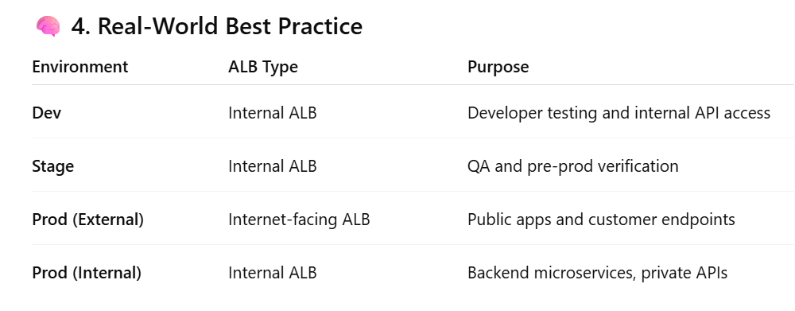

#### AWS CDK with Python --

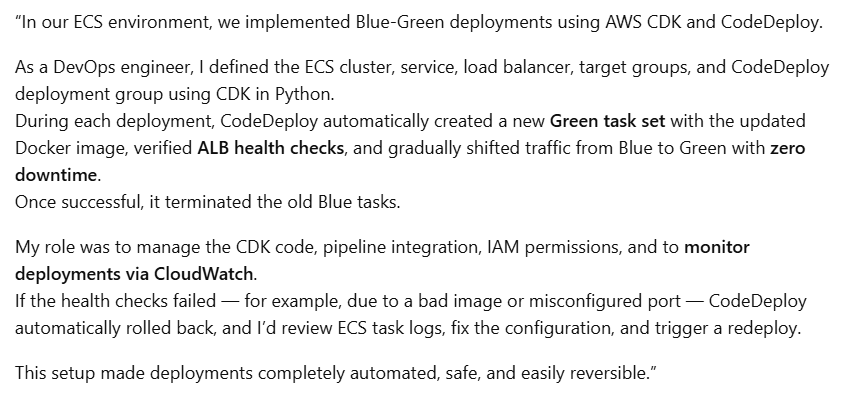
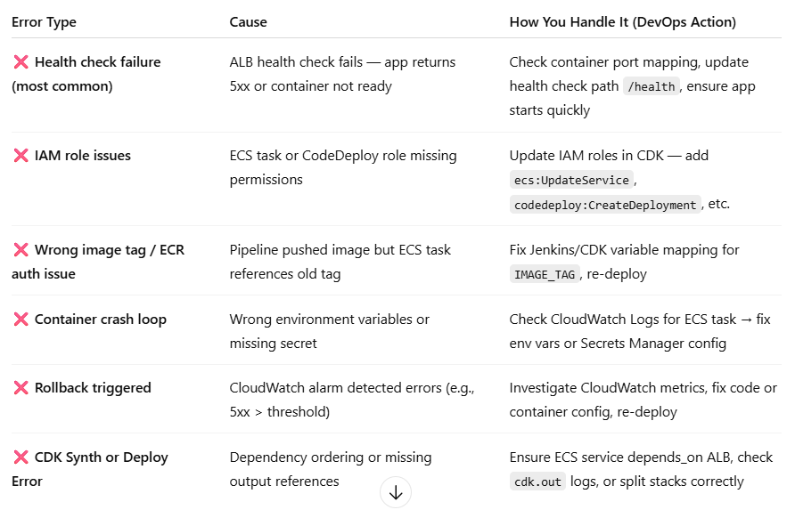
    
    “In one of our projects, we needed to ensure data resilience (continuous recovery and cross-region availability) across AWS regions. So I automated S3 Cross-Region Replication (CRR) using AWS CDK in Python.
    
    I built a CDK stack that defines both the source and destination S3 buckets, enabled versioning, and created an IAM replication role. Then, I configured replication rules programmatically by specifying the destination bucket ARN and handling delete-marker replication.
    
    Once deployed, any new object uploaded to the primary bucket in ap-south-1 is automatically replicated to the DR bucket in another region.
    
    To operationalize this setup, I added a Python boto3 validation script running on a schedule (AWS Lambda + EventBridge) that checks:
    
    whether new objects are replicated
    replication timestamps
    missing versions or failures
    
    This helps us verify the RPO (Recovery Point Objective) stays near zero.
    
    🔔 CloudWatch Alerts + SNS Notifications (Added Component)
   
    I ensure proactive monitoring, I integrated CloudWatch + SNS notifications into the CDK:
    The Lambda validation script pushes custom CloudWatch metrics, such as:
        ReplicationSuccessCount
        ReplicationFailureCount
        ReplicationLagSeconds

    I created CloudWatch Alarms for:
    Replication failures > 0
    Replication lag > threshold (e.g., >120 seconds)

    These alarms trigger an SNS topic that sends notifications via:
        Email
        Slack (via webhook)
        PagerDuty (if configured)
    So, anytime replication is delayed or fails, the DevOps team immediately receives alerts and can take corrective action.

#### AWS tools----

    minoring tools like cloud watch and could trail.
        cloud watch monitoring system performing. (monitor cpu usage)
        cloud trail is who is done and what is happens.

    AWS security hub and graffana and promotheus
        Centralized security and compliance monitoring across your AWS environment.
    

#### ECS and EKS

    ECS full managed container service
    used for only aws
    cluster managed automatically
    quick deployment and aws cloud
    ------
    EKS fully managed by k8
    used for standrad k8
    required to managed nodes
    complex and managed multi cloud
    --------
    ECS = AWS-managed, simpler, tightly integrated with AWS. Good for users who want less overhead.
    EKS = AWS-managed Kubernetes, highly flexible, portable, but requires Kubernetes knowledge.
    ------------
    Use ALB (Ingress) for web APIs (like /auth, /credit-score).
    Use NLB (Service type LoadBalancer) for non-HTTP apps or static-IP access.
    teUse ClusterIP for internal-only communication.

#### S3

    types:  standrad s3 bucket: for storing TF state files, store build artifactory
            versioning : TF remote backend state for versioning and rollback
            Access-Logged :for access logs or audit tails

            # Enable Block Public Access at bucket and account level.  
            AWS KMS work flow:
                User    → AWS Service (e.g., S3, EBS)
                        → Calls AWS KMS API
                        → KMS uses your key to encrypt/decrypt
                        → Encrypted data stored in service

#### Cloud Trail

        Minitoring the logs. when unexpectly and bymistake any one deleted resources.

#### Cloud Watch

        Mintoring the metrics logs. when like how much cpu memory utilized and what s pending all these things.

#### security hub

        integrated tools likes guard duty and cloud trail
        it is the centralized 
#### Azure Disc and Azure File
#### AWS EBS and AWS EFS

#### Mango DB
    ulimit
    

============================
# Azure ======================
============================
#### 

==================================
# K8 =========================
=============================================
How to answer ANY K8s scenario
    Use this pattern:
    1️⃣ Observe (kubectl get / describe)
    2️⃣ Logs
    3️⃣ Root cause
    4️⃣ Fix
    5️⃣ Prevent
    Note:
    PV  -Persistance Volume
    PVC -Persistance Volume Clime
    Service = exposes Pods
    Ingress = HTTP routing layer on top of Services
    ConfigMap → non-sensitive
    Secret → passwords/tokens
    Stateless = no data stored inside the Pod (Deployemnt + Service + HPA) data stored in external source like db's
    Stateful = data must survive Pod restarts (db-sql, mango) (sateful + PVC)
    HPA - Horizontal Pod Autoscalling based on no of replicas based on metrics used for stateless services
    VPA - Vertical Pod Autoscalling based on changing cpu and memory required to restart the pod.  used for statefull service 

    

    Node goes down — what happens? how we can safe the pods in that how we can move that pods to other node.
        Node fails → Pods removed from Service
        Traffic shifts to healthy Pods
        Controllers recreate Pods
        Autoscaler adds nodes only if required

#### Deployment file 
    Kind Types:
        Deployment – most common (stateless apps)
        Job – run once and exit (migrations, batch tasks)
        CronJob – scheduled jobs (nightly cleanup, reports)
        ReplicaSet – created automatically by Deployment
        Pod – smallest unit (rarely used directly)
        StatefulSet → databases, Kafka (needs stable identity/storage)
        DaemonSet → one pod per node (logging/monitoring agents)
        
    Networking / Exposure
        These control traffic:
        Service – internal load balancing
        Ingress – external access (ALB / Nginx etc.)
        NetworkPolicy – pod-to-pod firewall rules
    Configuration
        These store settings:
        ConfigMap – non-secret config
        Secret – passwords / tokens
    Storage
        These handle volumes:
        PersistentVolume (PV)
        PersistentVolumeClaim (PVC)
    StorageClass
        Security / Access
        These control permissions:
        Namespace
        ServiceAccount
        Role
        ClusterRole
        RoleBinding
        ClusterRoleBinding

#### PV and PVC (Persistant Volume and Persistance Volume Clime)
    PV is a cluster-level storage resource provisioned by an administrator and it actual storage
    PVC is a request for storage made by a pod
    pods are used PVC. PVC are bounds with PV.
    PV have in AWS EBS and EFS volumes
    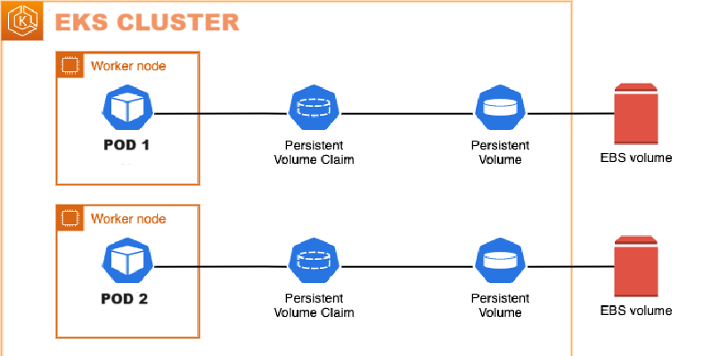
    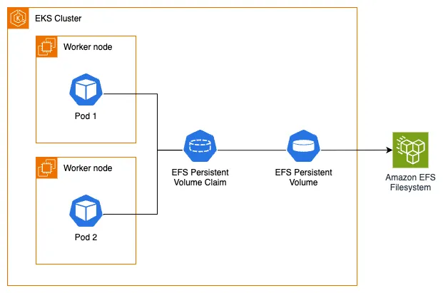
    PV have in Azure Azure Disc and Azure File
    ---------Questions-------------------
    Increase PV : when ever PV usage is increases. Prometheus detects (Threshould value like 80%), 
    Alertmanager notifies to webhook-triggered script, automation running pipeline and  resizes.
    
    PV Failure: When a PV is failing, we migrate data by creating a new PVC and attaching both the old and new PVCs to a temporary helper pod. We use tools like rsync to copy data safely. After verification, we update the application to use the new PVC and decommission the old one. This ensures zero data loss and controlled migration.”
    Flow like : Old PV → Old PVC → Helper Pod → New PVC → New PV
    Note: when ever pvc is created automatically pv created 
            PV name is disided by k8 not user.
    ------------------------------------------

## Pods
    The main difference is Pod-to-Pod networking: EKS uses AWS VPC CNI where Pods get real VPC IPs via ENIs, while AKS can use Azure CNI with VNet IPs or kubenet overlay networking.

    | Feature               | AWS EKS            | Azure AKS                               |
    | --------------------- | ------------------ | --------------------------------------- |
    | Pod IP                | Real VPC IP        | VNet IP (Azure CNI) / Overlay (kubenet) |
    | Networking            | Native VPC routing | Native or Overlay                       |
    | Pod density           | Limited by ENIs    | Higher with kubenet                     |
    | Security control      | SGs affect Pods    | NSGs at subnet/node                     |
    | Container → container | localhost          | localhost                               |

#### How pod ip is assigned
    Schedular --> ENI --> kubelet --> VPC CNI -->LIPAM (ENI--(available ips))
                            |-->kublet assign IP to pod
    ENI - Elastic Network Interface
    CNI - Container Network Interface
    LIPAM - Local IP Assign Manager
                            
        Scheduler selects the node
            EKS Scheduler decides:
            Run this Pod on Node-X
        It informs kubelet on that node.
            kubelet calls AWS VPC CNI
            kubelet says to VPC CNI:
            I need networking for this Pod (CNI ADD)

        VPC CNI asks L-IPAM for a free IP
            VPC CNI communicates with L-IPAM (local IP manager), which already has IPs from attached ENIs.
            L-IPAM provides an available IP.
        VPC CNI configures networking
            VPC CNI:
            Creates network namespace
            Configures veth
            Updates routing / iptables
        Connects Pod to ENI
        VPC CNI returns Pod IP to kubelet
        VPC CNI tells kubelet:
            Pod IP = 10.x.x.x
        kubelet assigns IP to Pod
            kubelet:
            Updates Pod status
            Starts containers
            Pod becomes Running
            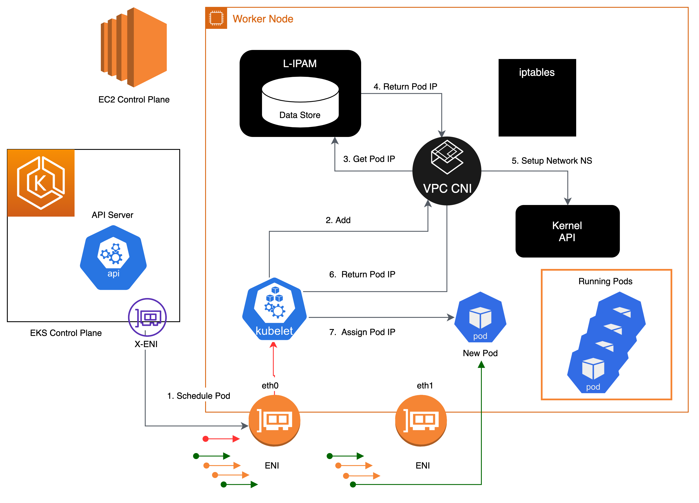

#### pod to pod connectivity EKS
    # pod to pod connectivity with same node
        connected with linux bridge, no VPC involvement, band width node-level NIC limit
    # pod to pod connectivity with different node
        connected with vpc network, VPC routing table, band width VPC network limit
        => each node having one ENI (Elastic Network Interface) or NIC (Network Interface card)
            depend on the EC2 instance m5.large we have 3 ENI's
            each ENI = 10 IP's (by default one IP reserve the ENI) 
    # in AKS
        same node connected with Local vswitch
        differnt node connected with Route via Azure VNET
    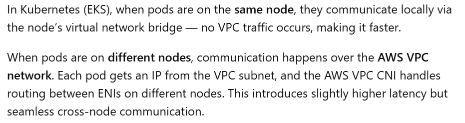
    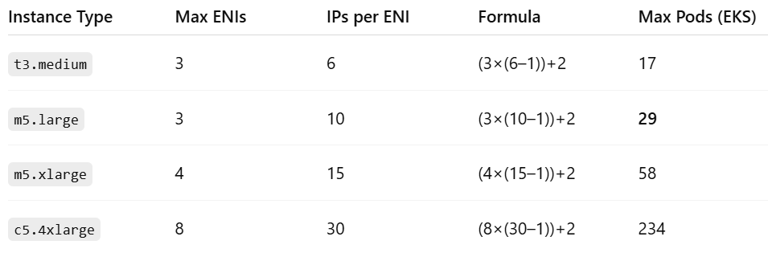

    Note : Node having Two ENIs Primary and Secondary
           Primary (Node Traffic + Control Plane)
           Secondary (Mainly focus on Pod IP) 

#### pod to container connectivty
    When a Pod is created, Kubernetes creates a dedicated network namespace with a single IP address and routing table. All containers inside the Pod join this same namespace, so they share the Pod IP and communicate with each other using localhost. Pod-to-pod traffic uses VPC networking, but container-to-container communication inside a Pod is purely local.

    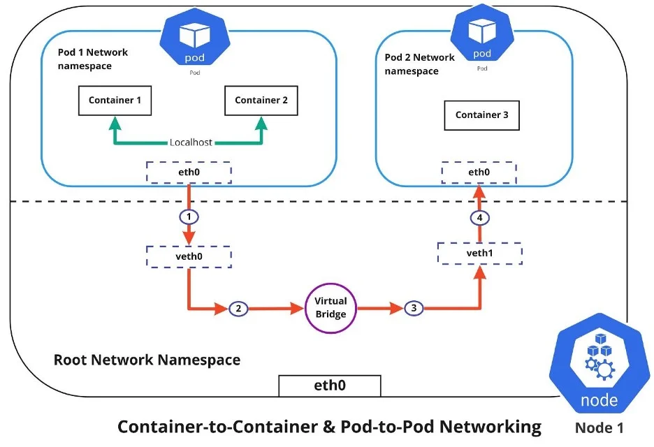

## Service
    Pods are not perminent like crashes, restart, move to another node. 
    Kubernetes Service provides a stable IP and DNS name and automatically routes traffic to healthy Pods, so users always connect through the Service instead of individual Pods.
    Service having label that label is connected pods.
    Service automatically updated the new pods. (when ever pod changes or restart the pods)
    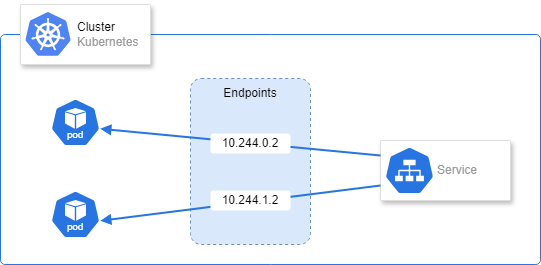
    
    Note: Service connected with endpoint with pods
            Service like Pod IP +DNS
            Endpoints like (Pod IP + DNS) + Port
    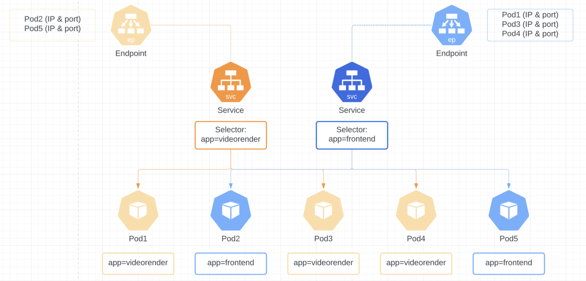
    
    Service Types:
        ClusterIP - Internal Cluster Only (Internal microservices)
        Node Port - Different Nodes (Temporary external access / testing)
        External Port- Mapping as a domine name (Production external access)
        Load balancer - Outside of the traffic (Point to external DNS)
        
    

#### how to connect service and pods
        Service and Pod connected communication through lable.
    Sample Code:--------------    
        apiVersion: v1
        kind: Service  # Type of Resource
        metadata:
        name: myapp-service  # Service Name
        spec:
          type: ClusterIP  # Type of Service
          selector:
            app: myapp        # MUST match Pod label
          ports:
            - port: 80        # Service port
                targetPort: 8080  # Container port
    ---------------------------------------
        kind Types:
            Deployment  → manages Pods (runs stateless apps)
            Service     → exposes Pods (Internal service-to-service communication)
            ConfigMap   → app config (Limit/ configs)
            Secret      → sensitive config (passwords)
            Ingress     → external HTTP routing (Expose banking APIs to internet)
            PVC         → storage request
            StatefulSet → stateful workloads (runs stateful apps)
            Job/CronJob  → batch/scheduled tasks
            Namespace    → environment separation

#### How is the connection made from one Service to another Service (service-to-service communication)?
        Services don’t talk to Services directly.
        Let’s use your banking example:
            account-service
            transaction-service
            notification-service
            All are ClusterIP.

        Account service calls transaction Service  using DNS
        DNS returns ClusterIP
        kube-proxy maps ClusterIP → Pod IP
        Traffic goes Pod → Pod
        Next service is called by application logic

#### Cross-Node Flow (Pod A on Node A, Pod B on Node B)
        What happens
        Pod A calls serviceB (DNS → ClusterIP).
        kube-proxy on Node A selects Pod B IP and rewrites the packet.
        Packet exits Node A via Node A ENI.
        VPC routing forwards it to Node B ENI.
        Node B delivers packet to Pod B network namespace.

        Pod A  → Service (virtual, via kube-proxy on Node A) → Node A ENI → VPC routing → Node B ENI → Pod B
        
        Same node → kube-proxy → local Pod (Linux networking)
        Cross node → kube-proxy → Node A ENI → VPC → Node B ENI → Pod

#### You want to restrict inter-namespace communication. How?

#### diff docker container and k8 pod

    k8 pod is lowest level deployment
    multiple container is maintained in the pod

## Namespace
#### what is namespace of Pod
    Kubernetes doesn’t assign a user-visible name to the Pod network namespace. The container runtime creates a Linux network namespace internally, usually referenced by a file path or PID, and all containers in the Pod join that namespace.

    logical isolation of resources, networking, policies and rbac and everything.
    
    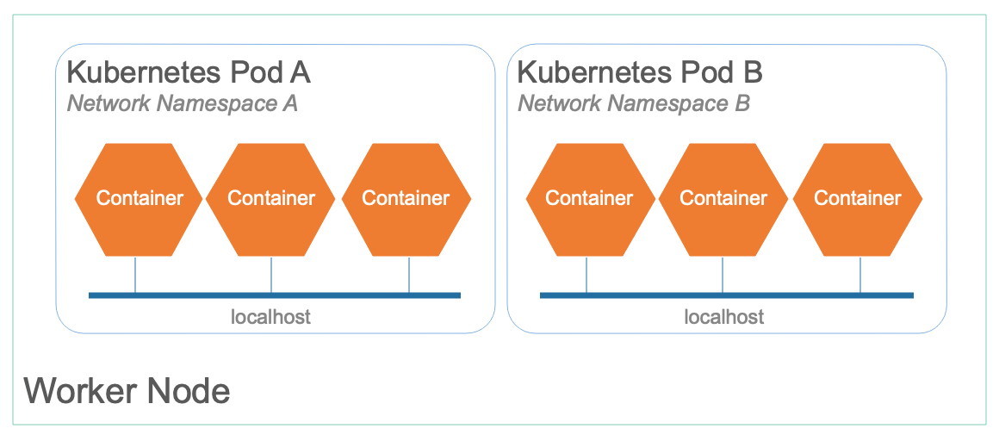

#### pod to pod connectivity EKS
    # pod to pod connectivity with same node
        connected with linux bridge, no VPC involvement, band width node-level NIC limit
    # pod to pod connectivity with different node
        connected with vpc network, VPC routing table, band width VPC network limit
        => each node having one ENI (Elastic Network Interface) or NIC (Network Interface card)
            depend on the EC2 instance m5.large we have 3 ENI's
            each ENI = 10 IP's (by defulat one IP reserve the ENI) 
    # in AKS
        same node connected with Local vswitch
        differnt node connected with Route via Azure VNET
    
    

#### statefull and stateless
        Statefull means data will store on the PVC so each pod having PVC no  data loss.
        Stateless means no data store in the pod only deployment + Service + HPA

          Stateless	                Stateful
        Deployment	            StatefulSet
        No data inside Pod	    Data must persist
        No PVC	                Needs PVC
        Easy to scale	        Careful scaling
        APIs / web apps	        Databases

        Stateless applications don’t store data in Pods and typically run on Deployments with HPA. Stateful applications like databases require persistent storage, so we use StatefulSets with PVCs to maintain stable identity and data across Pod restarts.
#### Daily activity of k8

    Check pod health checks:    kubectl get pod -a:     grafana dashboard alterting pod crashloop
    Check pod restart alert:    kubectl logs:        Prometheus metric restarts_total triggers alert
    node resources:             kubectl top node:   Grafana Node Exporter metrics
    pvc not bound:              kubectl get pvc:    Alert: “PVC pending > 10 minutes”
    cluster utilzation:         kubectl get node:   Grafana cluster overview dashboard
    Deployement status:         kubectl rollout status: Grafana “Deployment health” dashboard

    “In our setup, Grafana was deployed as part of the kube-prometheus-stack Helm chart, which automatically loads default dashboards for Kubernetes cluster, node, and pod metrics. We also imported a few community dashboards from Grafana.com to monitor EKS-specific metrics like API latency and pod restarts.”

#### Daily workflow in real DevOps setup

#### Morning check dashboards

            Open Grafana dashboards (Cluster Overview, Workload Health).
            Review any red/yellow alerts triggered overnight.
            Check alert notifications (Slack/Email).

#### Investigate alerts

            If Grafana shows a spike in CPU or pod restarts → use kubectl to debug the specific pod or deployment.

#### Remediate issues

            Restart pods, scale deployments, or fix underlying issues (like node resource exhaustion).

#### Update monitoring rules if needed

            Modify alert thresholds (e.g., adjust CPU limits).
            Add new panels for new services.

#### Document findings

            Update team Slack or incident management system.

#### Ingress controller

    An Ingress Controller is a Kubernetes component that manages external access to multiple services inside the cluster — typically over HTTP and HTTPS.
    It acts as a Layer 7 (application layer) load balancer, enabling path-based and host-based routing to different services using a single entry point.

    Client → DNS → Load Balancer (ALB) → Ingress Controller (ALB controller) → Service → Pod

    By default, an EKS cluster doesn’t come with an ALB Ingress Controller.

---------------------------------------------

# CI/CD Pipeline Flow Explanation (Step-by-Step)==================

## Code Push and Pull Request (PR)

    Developers push their code changes to the Git repository.
    After the push, they raise a Pull Request (PR) for review and approval.
    Once the PR is reviewed and merged into the required branch (e.g., main or develop), it automatically triggers the CI/CD pipeline.

## Pipeline Trigger when PR merged

    The pipeline is configured to trigger automatically on PR merges using a webhook or pipeline trigger configuration in the CI tool (e.g., Jenkins, GitHub Actions, GitLab CI, or Harness).

## Build Stage (Maven Build)

    The pipeline starts with a Maven build, compiling the source code.
    It runs unit test cases to validate code functionality and quality.
    Maven then packages the application based on the pom.xml configuration — generating .jar or .war files depending on the project type. (jar file is java based .war file for web based)

## Docker Build Stage

    Using a Dockerfile, the pipeline builds the Docker image of the application.
    The image is tagged with version details (for example: v1.0.0 or build-<build_id>) for version control and traceability.

## Security Scanning (Trivy)

    The built image is scanned using Trivy to identify vulnerabilities.
    If critical vulnerabilities are found, the pipeline fails and sends feedback to the developer to fix the issues.
    If the scan passes with no critical issues, the pipeline proceeds.

## Push to Amazon ECR

    The pipeline logs in to Amazon Elastic Container Registry (ECR).
    The validated Docker image is pushed to ECR for versioned storage and future deployments.

## Disaster Recovery Backup in S3 bucket

    For disaster recovery purposes, a copy of the Docker image (or metadata) is also stored in an S3 bucket.

## Deployment to Amazon ECS

    The pipeline updates the ECS Task Definition with the new Docker image tag.
    The ECS Service is updated or redeployed to use the new task definition.
    ECS automatically schedules new tasks and manages scaling based on load and desired count.

## Post-Deployment Validation

    ECS monitors the deployment to ensure containers are running successfully.
    If issues occur, ECS or the pipeline can trigger an automatic rollback to the previous stable image.

## Docker Commnads

    docker images
    docker pull <image_name>:<tag>
    docker build -t <image_name>:<tag> <path>
    Remove an image:    docker rmi <image_id_or_name>
    List running containers:   docker ps
    List all containers (running + stopped):    docker ps -a
    
    Run a container:    docker run -it --name <container_name> <image_name>:<tag>
    Stop a container:   docker stop <container_id_or_name>
    Start a container:  docker start <container_id or name>
    ReStart a container:  docker restart <container_id or name>
    Remove a container:  docker rm <container_id or name>

    List of volumes:    docker voulme ls
    create volume:  docker volume create <volume_name>
    remove voulme:  docker volume rm <voulme_name>
    You can mount the volume to a specific path inside the container:
        docker run -d --name my-container -v my-volume:/app/data <image_name>

    list of network:    docker network ls
    create network:     docker network create <network_name>
    remove network:     docker network rm <network_name>
    Connect container to network:
        docker network connect <network_name> <container_name>

    clear docker junk files:        docker system prune -a -f
    find the files larger 1GB:      find / -type f -size +1GB -exec ls -lh {} \;
    find larger directories in specific path: du -h /var/* | sort -h
    find which directory used more space:    du -sh * | sort -h

    Linux commands
    Most space dir  du -sh * | sort -h
    Find files larger than 1 GB  
            find / -type f size +1GB -exec ls -lh {}\;
    which dir used more space  du -sh * | sort -h
    Disk usage  df -h and du -sh /path
    top
    Real-time CPU, memory, load average, and process usage.
    vmstat
    Shows memory, CPU, I/O, swap usage (system performance overview).
    free
    Displays total, used, and free memory (RAM + swap).
    df
    Disk usage per filesystem.
    Kill process: kill <PID>
    Change permission  chmod 755 file
    Change file owner  sudo chown user:group filename.sh
    User creation:
    New user  sudo useradd user_name
    New group  sudo groupadd group_name
    Add in group  sudo usermod -aG group_name user_name
    Give only one user required readonly access   sudo setfacl -m u:use_name:r-- /file_path.sh
    Remove write access particular user  sudo setfacl -Rm u:user_name:rx /file_path.sh

    Cron job
    Find list of jobs  Crontab -l
    Edit the cron job  Crontab -e
                                    ***** /file_path.sh

 
    

## NACL (Network Access Control List): Subnet Level/ Stateless/ Default NACL allows all/

## Security Group:     Instance Level/ Stateful/ Default SG denies all inbound/

  
===============================

# Terraform ++================

===============================
    we have a commands for init plan apply and destroy
    modules we can use
#### Terraform List of Commnds
    terraform init        : Initializes a Terraform working directory and downloads providers.
    terraform validate    : Validates Terraform configuration syntax.
    terraform fmt         : Formats Terraform configuration files.
    terraform plan        : Shows execution plan (preview of infrastructure changes).
    terraform apply       : Creates or updates infrastructure based on configuration.
    terraform destroy     : Destroys all Terraform-managed infrastructure.
    terraform show        : Displays current Terraform state in readable format.
    terraform output      : Displays output values from Terraform state.
    terraform refresh     : Updates Terraform state from real infrastructure.
    terraform state list  : Lists all resources tracked in Terraform state.
    terraform state show  : Shows details of a specific resource in state.
    terraform state rm    : Removes resource from Terraform state (does not delete cloud resource).
    terraform import      : Imports existing infrastructure into Terraform state.
    terraform providers   : Lists providers used in the configuration.
    terraform graph       : Generates visual graph of resources.
    terraform version     : Shows Terraform version.
    terraform workspace list   : Lists Terraform workspaces.
    terraform workspace new    : Creates a new workspace.
    terraform workspace select : Switches to another workspace.
    terraform taint       : Marks resource for recreation on next apply. (forcely recreate the resources)
    terraform untaint     : Removes taint from resource. (terraform not created in next tf apply)
    terraform console     : Opens interactive Terraform console.
    terraform login       : Authenticates Terraform Cloud.
    terraform logout      : Logs out from Terraform Cloud.

    terraform datasource --> get actual information from cloud.
    terraform import --> add the resources information to tf state file.

## Blue green deployment

    ---------------------
    In our project, we used Blue-Green deployment across multiple production regions.
    We first created new instances (Green), deployed the application and Data Plane, and synced it with Kong Konnect Control Plane.
    After verifying the sync, custom plugins, and endpoint health, we switched traffic from Blue to Green by updating the ALB target group through Terraform.
    This provided zero downtime, safe rollback, and consistent multi-region rollout.
    ---------------------
    # terrform files: providers.tf, backend.tf, versions.tf, main.tf, output.tf, variables.tf, terraform.tfvars
        .tfvars file is filled with actual variable we can call from .tf file.
    # terraform.tfstate 
        file is keep tracking the current state resources
    if you need to update or add new resources state file is checking wheher the update of resources already exist or not.

    state file is deleted we can import the state file from s3 bucket if backup is there.

    # terraform refresh : manuall update resources synch 
    # terraform taint: Marks a resource for recreation in the next apply.
    # terraform import: Imports existing resources into Terraform state without re-creating them.
    # data source: They let you fetch information from existing resources (read-only).
    # drift: Run terraform apply → to reconcile drift.
             Run terraform refresh → to sync the state.
    
## Your team stores Terraform state in an S3 backend. During an apply, you get an error saying

    Error acquiring state lock: ConditionalCheckFailedException
    terraform using dynamo db for state lock so somebady is alredy apply done
    so we need to wait until the sucess after that we can use terraform force-unlock <lock-id>

## You lost your local terraform.tfstate file — what do you do?

    if the backend we can use the s3 bucket for storage
    we can re-run the terraform init it will download the .tfstate file

## You have a Terraform setup for multiple OUs (Dev, Prod, Security) under AWS Organization

    You only want to apply the changes to the Dev OU. How do you ensure that?

## how we can choose tf state file in s3 bucket?

    we can use backend.tf
    we can use versioning_configuration statu= enable 

    

=====================================

# Harness ====================

==================================

## Compare the Harness and Azure DevOps

    Azure DevOps is complete devops related like boards, repos ci cd 

    In my last project, we used both Azure DevOps and Harness, so I’ve seen the difference firsthand.

    For example, in Azure DevOps, we had our CI/CD pipeline defined completely in YAML — the build stage used Maven to package code, SonarQube for scanning, then we pushed the Docker image to ECR and deployed it to AKS using Helm. It worked, but most of the steps were scripted manually, including rollback logic and health checks. Whenever we needed approval gates or post-deployment validation, we had to build custom stages or rely on external scripts.

    When we moved part of the setup to Harness, the same pipeline became much simpler. We just connected our Git repo and ECR through built-in connectors, defined services and environments visually, and Harness handled the deployment with built-in rollback and verification. It pulled metrics from Prometheus to validate each release automatically. We also used its delegate to run pipelines securely in our own network, without exposing credentials.

    So, the main difference I noticed is that Azure DevOps gives full control but needs more effort and YAML scripting, while Harness automates most of that — it’s more intelligent and faster for multi-cloud and Kubernetes deployments. For large-scale delivery pipelines, Harness saved us a lot of time and reduced manual intervention.”
---------------------
    We used Harness connectors for Git, SonarQube, and AWS, so we didn’t have to script authentication or API calls manually. The pipeline triggered automatically on each commit, built the artifact using Maven, ran the SonarQube quality gate, and then built and pushed the Docker image to ECR. From there, our Harness CD pipeline deployed it to EKS. Everything ran through the Harness delegate, keeping credentials secure and infrastructure isolated. This reduced our YAML complexity drastically compared to Azure DevOps.

## What is a Harness Delegate?

    A: A Delegate is a lightweight agent installed in your environment (on-prem or cloud) that connects Harness to your infrastructure securely. It executes pipeline tasks like deployments, fetching artifacts, or connecting to Kubernetes clusters.

## How did you handle rollbacks in Harness?

    A: Harness’ continuous verification feature monitored metrics/logs after deployment. If the plugin or service failed health checks, Harness automatically rolled back to the last stable version.

    interview
    k8
    rosource utilization
    crash loop back
    db 

    pipeline
    azure devops secrect integrate

=========================================

## Azure DevOps

=========================================

    ---------------
    “In my last project, we deployed a .NET microservice (code stored in Azure Repos) to AWS EKS using Azure DevOps pipelines.
    The CI pipeline was designed to build, test, and scan the code using SonarQube for code quality and Trivy for container vulnerability scanning.
    Trivy helped us detect vulnerabilities in the base image, which we resolved by upgrading to a patched version.

    In the CD stage, Terraform was used to provision EKS infrastructure components like node groups, IAM roles, and networking resources, while Helm charts handled the deployment of .NET containers into EKS namespaces.
    Secrets and credentials were securely fetched from HashiCorp Vault at runtime to avoid hardcoding.

    We configured ALB Ingress for routing traffic between multiple microservices and used Prometheus and Grafana for monitoring API latency, error rates, and resource utilization.

    Additionally, I handled and resolved issues such as CrashLoopBackOff pods (caused by missing environment variables), Helm release failures due to version conflicts, and Docker build errors by adjusting the dotnet publish step.

    I also optimized the pipeline by enabling build caching and implemented approval gates before production deployment, ensuring smooth and secure delivery across Dev, QA, and Prod environments.”
    -----------------------------
    Issue                                     | Resolution
    Build failed due to missing NuGet packages: Cached dependencies and fixed version in .csproj
    Terraform apply failed (state lock / permission):   Used unique state files and fixed SPN roles
    Trivy scan failed (high CVEs):  Updated base image and re-scanned
    Helm deployment failed (CrashLoopBackOff):  Fixed image tag / env variable in Helm values
    Secrets not fetched from Key Vault: Updated Key Vault policy and renewed SPN certificate
    5xx errors after deployment:    Added missing environment variable and redeployed
    Pipeline too slow:  Added caching and parallel jobs to reduce time
    Merge blocked by branch policy: Resolved PR conflicts and re-ran validation build
    Terraform drift detected: Re-ran plan, reviewed manual changes, and re-applied infra
    SonarQube quality gate failed: Fixed code smells and vulnerabilities before merge

    
    “In my daily work, I manage CI/CD pipelines in Azure DevOps for multiple applications. I monitor build and release pipelines, troubleshoot failures, and ensure smooth deployments across Dev, QA, and Prod environments.

    For infrastructure provisioning, I use Terraform pipelines integrated with Azure DevOps, and the Terraform state files are stored securely in an Azure Blob Storage account. For example, when provisioning AKS clusters or Azure Key Vaults, I make sure that all resources are tagged properly and follow the organization's naming conventions.

    I’ve also integrated SonarQube and Trivy scans within the build stage for vulnerability and code quality checks. Once, we identified high-severity CVEs in base images through Trivy, so I updated the base Docker image version and re-triggered the pipeline to ensure a clean security report.

    For secrets management, I use Azure Key Vault — secrets like service principal credentials or database connection strings are dynamically pulled during the deployment, avoiding any hard-coded values in YAML files.

    Post-deployment, I validate application health using Azure Application Insights and Grafana dashboards. For instance, after one release, we noticed an increase in 5xx errors in Grafana metrics; I traced it back to a misconfigured environment variable and fixed it in the pipeline variable group.

    Additionally, I collaborate closely with developers to manage pull requests, enforce branch policies, and standardize pipeline templates across microservices. I also work on optimizing pipelines by adding caching for Maven dependencies and parallelizing build jobs — this reduced the overall build time by nearly 40%.

    # Example of Banking application user required credit score.
        we have like auth svc and credit score svc and customer user svc
            user login the app goes request auth svc
            auth svc validate the token and forward the request to credit score svc
            credit score svc fetch the user data from customer user svc
            it calls external credit bureau api
            api responce 820 score on the ui
            the meric logs are pushed to premethous and diplay the grafana.
                ----
                ALB and Ingress -- handle route and ssl termination
                Cluster IP - commincated internally the micro svc
                Vault Integration - secure secret manager
                Prometheus & Graffana - obeserbility of api performance
                IAM Roles - secure access b/w eks pods and aws svc's

    =============
    Thanks for the opportunity. I’m committed to giving my 100% and delivering the best results — both technically and professionally.”

===========================
# Jenkins ====================
===========================
#### CI/CD
    Developer → Git Push (Git Repo)
        ↓
    Jenkins Pipeline Trigger (webhook triggers)
            ↓
    Build → Test → Code Scan (sonar-scanner) (mvn clean package) and unit test (mvn test and npm test)
            ↓
    Docker Image Build ()
            ↓
    Image Scan (trivy image edu-backend:${BUILD_NUMBER})
            ↓
    Push to Registry (docker push edu-backend:${BUILD_NUMBER}
                        docker push edu-frontend:${BUILD_NUMBER})
            ↓
    Deploy to Kubernetes (helm upgrade --install edu-app ./helm \
                            --set image.tag=${BUILD_NUMBER})
            ↓
    Smoke Test / Notify (curl http://frontend-url/health)

#### sample pipeline code
    pipeline {
        agent any
        environment {
            IMAGE_NAME = "myapp"
            DOCKER_REGISTRY = "123456789012.dkr.ecr.us-east-1.amazonaws.com"
        }
        stages {
            stage('Checkout Code') {
                steps {
                    git branch: 'main',
                    url: 'https://github.com/org/myapp.git'
                }
            }
            stage('Build') {
                steps {
                    sh 'mvn clean package'
                }
            }
            stage('Unit Test') {
                steps {
                    sh 'mvn test'
                }
            }
            stage('Build Docker Image') {
                steps {
                    sh """
                    docker build -t $IMAGE_NAME:$BUILD_NUMBER .
                    docker tag $IMAGE_NAME:$BUILD_NUMBER $DOCKER_REGISTRY/$IMAGE_NAME:$BUILD_NUMBER
                    """
                }
            }
            stage('Push to ECR') {
                steps {
                    sh """
                    aws ecr get-login-password --region us-east-1 | \
                    docker login --username AWS --password-stdin $DOCKER_REGISTRY

                    docker push $DOCKER_REGISTRY/$IMAGE_NAME:$BUILD_NUMBER
                    """
                }
            }
            stage('Deploy to Kubernetes') {
                steps {
                    sh """
                    kubectl set image deployment/myapp \
                    myapp=$DOCKER_REGISTRY/$IMAGE_NAME:$BUILD_NUMBER
                    """
                }
            }
        }
        post {
            success {
                echo 'Pipeline executed successfully!'
            }
            failure {
                echo 'Pipeline failed!'
            }
        }
    }

=======================================
# Azure ======================
==============================
#### Azure Pipeline code =====
    trigger:
    - main

    pool:
    vmImage: ubuntu-latest

    stages:
    - stage: Build
    jobs:
    - job: BuildJob
        steps:
        - checkout: self
        - task: Bash@3
        displayName: "Run shell script"
        inputs:
            targetType: 'inline'
            script: |
            echo "Hello from Azure Pipeline"
            uname -a
            ls -la

=======================
# Resume Points ==============
========================

migrate the data
create data base to database bydirectioal synch
anlyging the roles permissions tables relations

## Optimized cloud infrastructure costs by right-sizing EC2/EKS workloads, reducing over-provisioned CPU and memory usage.
## Identified and removed unused resources (EC2, EBS, ELB, snapshots, NAT Gateways) using cost reports and automation scripts.
cloudwatch
    Identify the unused EC2 Instance through cloud watch <5% average 30days period.
    No network in/out activity
aws cost explorer

-------------------
    

=================================
TransUnion – Banking Project as a Sr DevOps Engineer 
Roles and Responsibilities
## Automated deployment of DP (Data Plane), CP (Control Plane), CPG (Control Plane Group), required custom plugins, and API deployments with Ansible Tower and AWX, and leveraging Konnect UI for proactive monitoring and validation.
## Designed and implemented multi-cloud Blue-Green deployment pipelines in Harness CI/CD, leveraging
## Terraform to provision EC2 environments across AWS, Azure, GCP, and on-prem data centers.
## Automated deployment verification and post-deployment checks via Konnect UI, improving release confidence and reducing manual validation efforts.
## Automated repository migration workflows from Bitbucket, GitHub, and GitLab by designing CI/CD pipelines in Harness, while also managing and maintaining inventory repositories to ensure consistency and traceability. 
## Migrated existing deployment workflows from Ansible Tower/Jenkins to Harness, improving release speed and reducing operational overhead.
## Developed and maintained Ansible playbooks and roles to standardize multi-environment deployments across cloud and on-prem platforms.
------------

===========================================
# Helm Chats =================
===========================================
    Structure of Helm Chats
        mychart/
        │
        ├── Chart.yaml        👈 REQUIRED (chart metadata)
        ├── values.yaml       👈 REQUIRED (default values)
        ├── templates/        👈 REQUIRED (all K8s manifests go here)
        │
        └── .helmignore       👈 optional

    ---Sample code of values.yaml-----------
        replicaCount: 2
        image:
            repository: myrepo/myapp
            tag: "1.0.0"
            pullPolicy: IfNotPresent

        service:
            type: ClusterIP
            port: 80

        resources:
            limits:
                cpu: "500m"
                memory: "512Mi"
            requests:
                cpu: "250m"
                memory: "256Mi"

        env:
            APP_ENV: dev
            LOG_LEVEL: info

        ingress:
            enabled: false
            host: myapp.example.com

    ---Sample code of chart.yaml-----------

        apiVersion: v2
        name: myapp
        description: A Helm chart for My Application
        type: application

        version: 0.1.0
        appVersion: "1.0.0"

# Gitops =====================
==============================
    GitOps is a modern approach to continuous deployment that uses Git as the single source of truth for declarative infrastructure and application configurations. It enables teams to manage and automate the deployment of applications and infrastructure using Git workflows.

# Ansible ====================
==============================
    
